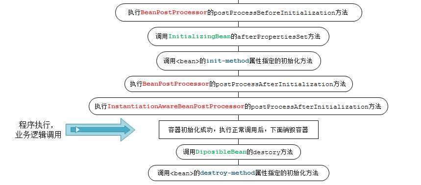

下图描述了Bean的生命周期。它是由IoC容器控制。IoC容器定义Bean操作的规则，即Bean的定义（BeanDefinition）。Bean的定义包含了BeanFactory在创建Bean实例时需要的所有信息。BeanFactory首先通过构造函数创建一个Bean实例，之后它会执行Bean实例的一系列之前初始化动作，初始化结束Bean将进入准备就绪（ready）状态，这时应用程序就可以获取这些Bean实例了。最后，当你销毁单例（Singleton）Bean时，它会调用相应的销毁方法，结束Bean实例的生命周期。

 

